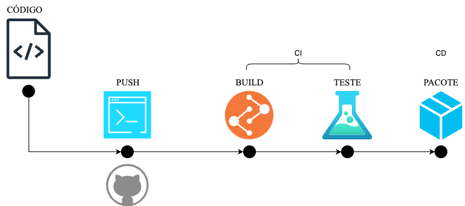

# CI/CD Example with Java and GitHub Actions

## Resumo do Projeto

Esta é uma simples aplicação em Java projetada para demonstrar os princípios de CI/CD usando GitHub Actions. 

O projeto inclui um programa básico em Java que ordena um array de números inteiros e um teste unitário correspondente para validar sua funcionalidade. 

A aplicação é construída e testada usando Maven, e o arquivo JAR resultante é publicado como um artefato.

## Importância do CI/CD

A Integração Contínua (CI) e o Deploy Contínuo (CD) são práticas que automatizam a integração de alterações de código feitas por múltiplos colaboradores em um único projeto de software, além da entrega desse código para ambientes de produção. 

O CI/CD preenche as lacunas entre desenvolvimento, teste e implantação, permitindo que as equipes liberem software de qualidade de forma rápida e eficiente.

### Integração Contínua (CI)

**Testes Automatizados**: 
Cada commit aciona testes automatizados, garantindo que as alterações não quebrem a funcionalidade existente. Isso reduz problemas de integração e permite que as equipes desenvolvam software coeso de forma mais rápida.

**Feedback Imediato**: 
Os desenvolvedores recebem feedback imediato sobre a compatibilidade do seu código com a base de código existente, permitindo correções e melhorias rápidas.

### Deploy Contínuo (CD)

**Implantação Automatizada**: 
Automatiza o processo de implantação, tornando possível implementar alterações em produção de forma rápida e segura.

**Entrega Consistente**: 
Garante que o software possa ser liberado de maneira confiável a qualquer momento, aumentando a velocidade de entrega para os usuários finais.

## Resumo do Projeto



- Workflow de CI: Constrói a aplicação e executa os testes.
  - Faz o checkout do repositório.
  - Configura o Java 11.
  - Constrói a aplicação e executa os testes unitários.
- Workflow de CD: Empacota a aplicação em um arquivo JAR e a carrega como um artefato.
  - Empacota a aplicação em um arquivo JAR executável.
  - Carrega o arquivo JAR como um artefato.

## Como Baixar e executar o Artefato JAR

1. Acesse a aba **Actions** do repositório no GitHub.
2. Selecione a execução mais recente do Workflow de CD.
3. Baixe o artefato chamado **Package**.
4. Extraia o arquivo ZIP para obter o arquivo JAR.
5. Via terminal, vá para o local do arquivo JAR.
6. Execute o arquivo:
```
java -jar <nome-do-pacote>.jar
```